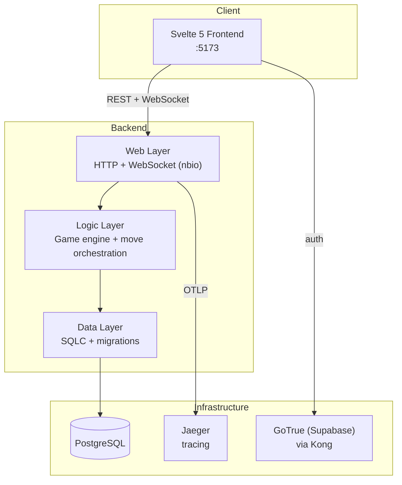

# GO Risk-It

[](https://github.com/go-risk-it/go-risk-it/actions/workflows/go.yml)
[](https://github.com/go-risk-it/go-risk-it/actions/workflows/golangci-lint.yml)
[](https://github.com/go-risk-it/go-risk-it/actions/workflows/component-test.yml)
[](https://github.com/go-risk-it/go-risk-it/actions/workflows/go.yml)

A multiplayer online [Risk](https://en.wikipedia.org/wiki/Risk_(game)) board game built in Go. Players compete to fulfill secret missions by conquering territories, managing armies, and eliminating opponents in real-time.

**[Frontend Repository](https://github.com/go-risk-it/go-risk-it-frontend)** | **[Architecture Docs](docs/architecture.md)** | **[Game Rules](docs/game-rules.md)**

## Architecture at a Glance



See [Architecture Docs](docs/architecture.md) for the full system design, Go package structure, move execution flow, and API reference.

## Prerequisites

- [Docker](https://docs.docker.com/get-docker/) and Docker Compose
- [Go 1.24+](https://go.dev/dl/)
- [Python 3](https://www.python.org/) + [Poetry](https://python-poetry.org/) (for component tests)

## Quick Start

Start the full stack (backend, PostgreSQL, Supabase auth, Jaeger):

```bash
make run
```

This spins up all services via Docker Compose. The API is available at `http://localhost:8080`.

Then start the [frontend](https://github.com/go-risk-it/go-risk-it-frontend) to play in the browser.

## Running the Full Stack

The game requires both the backend and frontend running together:

1. **Backend** — Start all backend services (Go server, PostgreSQL, Supabase auth, Jaeger):
   ```bash
   make run
   ```

2. **Frontend** — In a separate terminal, clone and start the frontend:
   ```bash
   git clone https://github.com/go-risk-it/go-risk-it-frontend.git
   cd go-risk-it-frontend
   npm install
   npm run dev
   ```

3. **Play** — Open `http://localhost:5173` in your browser. Sign up two accounts in separate browser windows to start a game.

## Development

### Setup

Install linters, formatters, and pre-commit hooks:

```bash
make install
```

### Code Generation

Generate [SQLC](https://sqlc.dev/) code for database queries:

```bash
make sqlc
```

Generate mocks for testing:

```bash
make mock
```

### Running Tests

Unit tests:

```bash
make test
```

Component tests (BDD with Python Behave — requires a running environment):

```bash
make cp
```

### All Make Targets

```bash
make help
```

## Testing Strategy

- **Unit tests** (`go test ./...`): Test individual packages in isolation with mocked dependencies using [testify](https://github.com/stretchr/testify) and [mockery](https://github.com/vektra/mockery).
- **Component tests** (`component-test/`): BDD-style integration tests written in Python with [Behave](https://behave.readthedocs.io/). These spin up the full backend via Docker and test game scenarios end-to-end through the REST API and WebSocket connections.

## Project Structure

```
internal/
├── api/                  # API contracts (request/response types)
│   ├── game/             #   Game API models + message payloads
│   └── lobby/            #   Lobby API models
├── config/               # Configuration management
├── ctx/                  # Context types
├── data/                 # Data access layer
│   ├── game/             #   Game DB (SQLC generated + migrations)
│   ├── lobby/            #   Lobby DB (SQLC generated + migrations)
│   └── migration/        #   Migration runner
├── logic/                # Business logic
│   ├── game/             #   Game engine
│   │   ├── move/         #     Move orchestration + phase handlers
│   │   ├── phase/        #     Phase management
│   │   ├── card/         #     Card logic
│   │   ├── mission/      #     Victory condition checking
│   │   ├── player/       #     Player state
│   │   ├── state/        #     Game state queries
│   │   └── advancement/  #     Phase advancement
│   └── lobby/            #   Lobby management
├── web/                  # HTTP + WebSocket layer
│   ├── game/             #   Game endpoints + WS manager
│   ├── lobby/            #   Lobby endpoints + WS manager
│   ├── middleware/        #   Auth middleware
│   ├── rest/             #   Route abstraction + health check
│   └── ws/               #   WebSocket utilities
└── testonly/             # Test-only endpoints (reset, setup-near-win)
```

## Tech Stack

| Component | Technology |
|-----------|-----------|
| Language | Go 1.24 |
| Web / WebSocket | [nbio](https://github.com/lesismal/nbio) |
| Database | PostgreSQL + [pgx](https://github.com/jackc/pgx) |
| Query generation | [SQLC](https://sqlc.dev/) |
| Migrations | [golang-migrate](https://github.com/golang-migrate/migrate) |
| Dependency injection | [Uber Fx](https://github.com/uber-go/fx) |
| Auth | [GoTrue](https://github.com/supabase/gotrue) (Supabase) via JWT |
| API gateway | [Kong](https://konghq.com/) |
| Logging | [Zap](https://github.com/uber-go/zap) |
| Tracing | [OpenTelemetry](https://opentelemetry.io/) + [Jaeger](https://www.jaegertracing.io/) |
| Config | [Koanf](https://github.com/knadh/koanf) |
| Testing | testify, mockery, [testcontainers-go](https://golang.testcontainers.org/) |
| Component tests | Python + [Behave](https://behave.readthedocs.io/) (BDD) |
