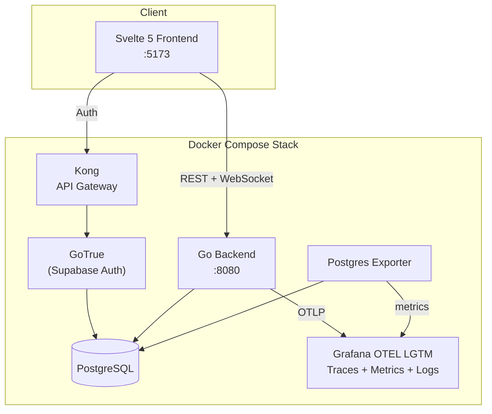

# GO Risk-It

[](https://github.com/go-risk-it/go-risk-it/actions/workflows/go.yml)
[](https://github.com/go-risk-it/go-risk-it/actions/workflows/golangci-lint.yml)
[](https://github.com/go-risk-it/go-risk-it/actions/workflows/component-test.yml)
[](https://github.com/go-risk-it/go-risk-it/actions/workflows/invariant.yml)
[](https://github.com/go-risk-it/go-risk-it/actions/workflows/go.yml)

A multiplayer online [Risk](https://en.wikipedia.org/wiki/Risk_(game)) board game built in Go. Players compete to fulfill secret missions by conquering territories, managing armies, and eliminating opponents in real-time.

<!-- TODO: Add game screenshot -->

**[Frontend Repository](https://github.com/go-risk-it/go-risk-it-frontend)** | **[Architecture Docs](docs/architecture.md)** | **[Game Rules](docs/game-rules.md)**

## Architecture at a Glance



See [Architecture Docs](docs/architecture.md) for the full 10-layer system design, Go package structure, move execution flow, and API reference.

**[Component Architecture](docs/architecture-components.md)** | **[Auto-Generated Diagram](docs/architecture-diagram.svg)**

## Engineering Highlights

<!-- GEN:STATS_START -->
<!-- DO NOT EDIT — auto-generated by make docs -->
- **Living Architecture** -- Every package has a [`doc.go`](docs/doc-go-spec.md) with structured sections (`# Layer`, `# Key Types`, `# Dependencies`). CI validates layer claims against the actual import graph. [48 architecture rules](internal/) enforce boundaries at test time -- import constraints, quality ratchets, and documentation coverage.

- **Property-Based Testing** -- A custom [invariant framework](docs/testing-philosophy.md) simulates thousands of randomized games against a real Postgres database, checking [12 game-state invariants](internal/game/testing/invariant/doc.go) after every move. Failures auto-shrink to minimal reproducers via [rapid](https://pkg.go.dev/pgregory.net/rapid).

- **Event-Driven Architecture** -- A custom [EventBus](internal/kernel/bus/doc.go) with typed subscriptions, OTel linked spans, and sequential per-event dispatch. Zero external dependencies. Decouples game logic from WebSocket broadcasting.

- **Type-Safe Move Pipeline** -- Generic `Service[T, R]` interface with compile-time enforcement across 5 move types. The [orchestration pipeline](internal/game/internal/logic/move/orchestration/doc.go) runs validate, perform, log, check mission, and advance in a single transaction.

- **Auto-Generated Docs** -- A [Go tool](cmd/archdiagram/) reads the import graph and `doc.go` labels to generate 5 outputs: [D2 architecture diagram](docs/architecture-diagram.svg), [architecture.md](docs/architecture.md), [architecture-components.md](docs/architecture-components.md), [doc-go-spec.md](docs/doc-go-spec.md), and the project tree below. CI checks freshness via `make docs-check`.
<!-- GEN:STATS_END -->

## Prerequisites

- [Docker](https://docs.docker.com/get-docker/) and Docker Compose
- [Go 1.26+](https://go.dev/dl/)
- [Python 3](https://www.python.org/) + [Poetry](https://python-poetry.org/) (for component tests)

## Quick Start

Start the full stack (backend, PostgreSQL, Supabase auth, Grafana OTEL LGTM):

```bash
make run
```

This spins up all services via Docker Compose. The API is available at `http://localhost:8080`.

Then start the [frontend](https://github.com/go-risk-it/go-risk-it-frontend) in a separate terminal:

```bash
git clone https://github.com/go-risk-it/go-risk-it-frontend.git
cd go-risk-it-frontend
npm install
npm run dev
```

Open `http://localhost:5173` in your browser. Sign up two accounts in separate browser windows to start a game.

## Development

### Setup

Install linters, formatters, and pre-commit hooks:

```bash
make install
```

### Code Generation

Generate [SQLC](https://sqlc.dev/) code for database queries:

```bash
make sqlc
```

Generate mocks for testing:

```bash
make mock
```

### Running Tests

Unit tests:

```bash
make test
```

Component tests (BDD with Python Behave -- requires a running environment):

```bash
make cp
```

### All Make Targets

```bash
make help
```

## Testing Strategy

### Unit Tests

Standard Go tests with [testify](https://github.com/stretchr/testify) assertions and [mockery](https://github.com/vektra/mockery)-generated mocks. Every logic service package programs to an exported interface, enabling isolated unit testing through dependency injection.

```bash
go test ./...
```

### Property-Based Invariant Testing

A custom framework simulates complete games with randomized moves against a real Postgres database (via [testcontainers-go](https://golang.testcontainers.org/)). After every move, [12 named invariants](internal/testing/invariant/doc.go) are checked -- troop conservation, phase transition legality, territory integrity, card deck conservation, and more. Failures auto-shrink to minimal reproducers via [rapid](https://pkg.go.dev/pgregory.net/rapid). See [testing-philosophy.md](docs/testing-philosophy.md) for the full design rationale.

```bash
go test -tags invariant -v -timeout 300s ./internal/testing/invariant/
```

### Architecture Enforcement

[34 rules](internal/) run as standard Go tests, validating layer boundaries (logic never imports web), module isolation (game and lobby are fully independent), event system boundaries (events never import logic, bus import ratchet), import guards (no stdlib `log`, no old `math/rand`), package quality ratchets (export ceilings, fan-out limits, file count limits), and documentation coverage (doc.go existence and section completeness).

### Component Tests

BDD-style integration tests written in Python with [Behave](https://behave.readthedocs.io/). These spin up the full backend via Docker and test game scenarios end-to-end through the REST API and WebSocket connections.

```bash
make cp
```

### CI Pipeline

Six separate GitHub Actions workflows enforce quality gates:
- **go** -- build, unit tests, coverage reporting
- **golangci-lint** -- static analysis
- **component-test** -- full-stack BDD tests
- **invariant** -- property-based game simulations
- **format** -- code formatting checks
- **deadcode** -- unused code detection

## Project Structure

<details>
<summary>Project Structure (click to expand)</summary>

<!-- GEN:PROJECT_TREE_START -->
<!-- DO NOT EDIT — auto-generated by make docs -->
```
internal/
├── game/
│   ├── api/                # Package game defines shared types for the game API surface.
│   │   ├── messaging/          # Package messaging defines the WebSocket message envelope and type constants
for real-time communication with game clients.
│   │   ├── moves/
│   │   │   ├── attack/             # Package attack defines the result types for attack move execution.
│   │   │   └── cards/              # Package cards defines the result types for cards move execution.
│   │   ├── rest/
│   │   │   ├── request/            # Package request defines the JSON request bodies for game REST endpoints.
│   │   │   └── response/           # Package response defines the JSON response bodies for game REST endpoints.
│   │   └── snapshot/           # Package snapshot defines the clean domain types for game state snapshots.
│   ├── ctx/                # Package ctx defines the game-scoped context type that enriches
[kernelctx.UserContext] with a game ID. [GameContext] composes user identity,
OTel tracing, and game-scoped metadata so that every layer of the game module
has typed access to the active game. [WithGameID] constructs a GameContext
from an authenticated user context.
│   ├── events/             # Package game defines game-scoped domain events and typed subscription helpers.
│   ├── internal/
│   │   ├── config/             # Package config provides game-specific configuration types loaded from the
"game" section of the application YAML. It receives a *koanf.Koanf from
the kernel config module and unmarshals the game subsection.
│   │   ├── data/
│   │   │   └── db/                 # Package db composes the sqlc-generated game queries with transaction support.
│   │   ├── handlers/           # Package handlers contains event-driven consumers for game domain events.
│   │   ├── logic/
│   │   │   ├── board/              # Package board models the Risk game board as a graph of regions and
continents. It lazily loads the board topology from a JSON file and
provides adjacency queries (neighbour checks, reachability through
player-owned regions) and continent control calculations.
│   │   │   ├── card/               # Package card manages the card deck: creation during game setup, querying
a player's hand, and transferring card ownership when a player is
eliminated. Each region is mapped to one card (infantry, artillery, or
cavalry), plus two jolly cards per game.
│   │   │   ├── creation/           # Package creation orchestrates full game setup: inserting the game record,
creating players, assigning missions and regions, generating the card deck,
and creating the initial deploy phase. The entire operation runs inside a
single transaction, with post-commit events and metric recording.
│   │   │   ├── metrics/            # Package metrics provides game-specific OTel metrics ([GameMetrics]) for
tracking active games, game duration, per-game summary histograms (moves,
attacks, turns, headlines), and [GameTiming] for recording game start times
and computing elapsed duration. [GameSummaryRecorder] subscribes to bus events
and records summary histograms at game completion.
│   │   │   ├── mission/            # Package mission manages game missions: creation, assignment to players,
win-condition checking, and reassignment when a player is eliminated.
Five mission types are supported — two continents, two continents plus one,
eighteen territories, twenty-four territories, and eliminate player.
│   │   │   │   └── checker/            # Package checker provides the mission-checking framework. Each mission type
implements [MissionChecker] as a pure evaluator over cached snapshot data,
and a [Registry] maps mission types to their checkers for dispatch during
win-condition evaluation.
│   │   │   ├── move/
│   │   │   │   ├── attack/             # Package attack implements the attack move: a player sends troops from an
owned region to an adjacent enemy region. Dice rolls determine casualties,
and the phase walker decides whether the game transitions to CONQUER (if a
region was conquered), REINFORCE (if the player chooses to stop or has no
eligible attackers), or stays in ATTACK.
│   │   │   │   │   └── dice/               # Package dice provides a configurable dice service for attack resolution.
The roll strategy (random, attacker_always_wins, attacker_always_loses)
is determined by configuration, enabling deterministic testing alongside
production randomness.
│   │   │   │   ├── cards/              # Package cards implements the cards move: a player plays card combinations
to earn extra deployable troops and optional region troop grants. The
phase always transitions to DEPLOY after cards are played, and the
advancer calculates the total deployable troops (region ownership +
continent bonuses + card combination bonuses).
│   │   │   │   ├── conquer/            # Package conquer implements the conquer move: after a successful attack
reduces a defending region to zero troops, the attacker must move troops
into the conquered region. The move validates minimum troop requirements,
transfers region ownership, and handles player elimination (card transfer
and mission reassignment).
│   │   │   │   ├── deploy/             # Package deploy implements the deploy move: a player places available
troops onto regions they own. Each move validates region ownership,
declared troop counts, and deployable troop availability. The phase
transitions to ATTACK once all deployable troops are placed.
│   │   │   │   ├── orchestration/      # Package orchestration coordinates the execution of game moves through an
effects-first pipeline: validate, perform (pure), walk, advance (pure),
check mission (pure), build state, build persistence effect, persist
(write-only ReadCommitted TX), cache update, emit events.
│   │   │   │   ├── reinforce/          # Package reinforce implements the reinforce move: a player moves troops
between two owned regions that are connected through a path of owned
territory. After reinforcement, the phase transitions to CARDS (if the
next player has a valid combination) or DEPLOY (otherwise), advancing
the turn. If the player conquered a region during the turn, a card is
drawn before advancing.
│   │   │   │   ├── service/
│   │   │   │   └── validation/         # Package validation provides composable move validation helpers shared
across move types: region ownership checks (source owned, target owned or
not owned) and declared troop count verification against actual database
values.
│   │   │   ├── phase/              # Package phase manages game phase transitions. It defines the phase state
machine (CARDS -> DEPLOY -> ATTACK -> CONQUER/REINFORCE and back),
validates transitions, and handles turn advancement when crossing from
REINFORCE to the next player's turn.
│   │   │   ├── player/             # Package player manages game players: creation during game setup, querying
player state (region counts, turn order), and determining the current and
next active player. Eliminated players (zero regions) are skipped during
turn rotation.
│   │   │   ├── region/             # Package region manages game regions: creation with player assignment,
querying by game or player, troop updates, and ownership transfers during
conquest. Region assignment strategy (random or sequential) is injected
via the assignment sub-package.
│   │   │   │   └── assignment/         # Package assignment provides configurable strategies for distributing
regions among players during game setup. The strategy (sequential or
random) is determined by configuration.
│   │   │   └── state/              # Package state provides the game state service for reading core game
metadata: current turn, active phase, winner, and the list of games a
user has joined.
│   │   ├── rand/               # Package rand provides a seedable random number generator for game mechanics.
│   │   └── snapshot/           # Package snapshot provides aggregated read models for efficient game state
retrieval. [Service.GetPublicSnapshot] returns the full public state
(game metadata, phase, board, players) and
[Service.GetPrivateSnapshotsByUser] returns per-player private state
(cards, mission). All queries execute sequentially on a single connection,
avoiding the DB pool starvation caused by parallel fetcher goroutines.
│   ├── testing/            # Package testing provides test infrastructure for the game module.
│   │   └── invariant/          # Package invariant implements a property-based testing framework for the Risk game engine.
│   ├── testmocks/
│   │   ├── data/
│   │   │   └── db/
│   │   ├── handlers/
│   │   ├── logic/
│   │   │   ├── board/
│   │   │   ├── card/
│   │   │   ├── creation/
│   │   │   ├── mission/
│   │   │   │   └── checker/
│   │   │   ├── move/
│   │   │   │   ├── attack/
│   │   │   │   │   └── dice/
│   │   │   │   ├── cards/
│   │   │   │   ├── conquer/
│   │   │   │   ├── deploy/
│   │   │   │   ├── orchestration/
│   │   │   │   ├── reinforce/
│   │   │   │   └── service/
│   │   │   ├── phase/
│   │   │   ├── player/
│   │   │   ├── region/
│   │   │   │   └── assignment/
│   │   │   └── state/
│   │   ├── rand/
│   │   └── snapshot/
│   ├── web/                # Package webgame is a minimal FX module for the game web layer.
Event handling has moved to internal/game/internal/handlers/.
│   │   └── routes/             # Package routes defines the HTTP route table and REST controllers for game
operations.
│   └── ws/                 # Package ws manages per-game WebSocket connections.
├── kernel/
│   ├── bus/                # Package bus provides the domain event bus for decoupled communication.
│   ├── config/             # Package config loads application configuration from YAML files and
environment variables using koanf. It reads a YAML file named after
the ENVIRONMENT variable (defaulting to "component-test.yml"), then
overlays any matching environment variables.
│   ├── ctx/                # Package ctx defines the typed context chain used throughout the server.
│   ├── data/               # Package data provides shared database primitives for transaction management.
│   │   ├── migration/          # Package migration runs database schema migrations at startup.
│   │   └── pool/               # Package pool creates and manages pgx connection pools.
│   ├── errors/             # Package domainerrors defines typed domain errors with category-based HTTP
status mapping. All domain errors implement the [Categorizable] interface,
allowing error handlers to map errors to appropriate HTTP status codes
(400, 401, 403, 404, 409) without type-switching on concrete types.
│   ├── logger/             # Package logger provides a structured event logging consumer for the event bus.
│   ├── metrics/            # Package metrics registers manual OpenTelemetry instruments for resource
state that has no span equivalent. These are the only metrics that should
be created by hand — all request-scoped metrics (latency, throughput,
errors) are derived automatically from traces by the spanmetrics connector.
│   ├── observe/            # Package observe provides unified observability primitives for dual-signal
emission: every call site emits both an slog log record and an OTel span
event through a single function call. Business logic uses observe instead
of importing log/slog or go.opentelemetry.io/otel directly.
│   ├── otelsetup/          # Package otelsetup initializes the OpenTelemetry SDK for tracing and metrics.
│   ├── safego/             # Package safego provides panic-safe operation wrappers with OTel span
integration.
│   ├── slog/               # Package slog configures structured JSON logging with automatic context enrichment.
│   └── upgradablerw_mutex/ # Package upgradable_rw_mutex provides an [UpgradableRWMutex] that extends
sync.RWMutex with the ability to atomically upgrade a read lock to a write
lock without releasing it first.
├── loadtest/
│   ├── annotations/
│   ├── baseline/
│   ├── chaos/
│   ├── client/
│   ├── dbstats/
│   ├── fileutil/
│   ├── gamestate/
│   ├── health/
│   ├── journal/
│   │   └── session/
│   ├── mapgraph/
│   ├── metrics/
│   ├── orchestrator/
│   ├── player/
│   │   ├── heuristic/
│   │   └── smart/
│   ├── resources/
│   ├── runner/
│   ├── scenario/
│   └── userpool/
├── lobby/
│   ├── api/
│   │   ├── messaging/          # Package messaging defines the WebSocket message types sent to lobby clients.
│   │   ├── rest/
│   │   │   ├── request/            # Package request defines the JSON request bodies for lobby REST endpoints.
│   │   │   └── response/           # Package response defines the JSON response bodies for lobby REST endpoints.
│   │   └── snapshot/           # Package snapshot defines the lobby snapshot types used as the canonical
representation of lobby state across module boundaries.
│   ├── ctx/                # Package ctx defines the lobby-scoped context type that enriches
[kernelctx.UserContext] with a lobby ID. [LobbyContext] composes user
identity, OTel tracing, and lobby-scoped metadata so that every layer of
the lobby module has typed access to the active lobby. [WithLobbyID]
constructs a LobbyContext from an authenticated user context.
│   ├── events/             # Package lobby defines lobby-scoped domain events and typed subscription helpers.
│   ├── internal/
│   │   ├── data/
│   │   │   └── db/                 # Package db composes the sqlc-generated lobby queries with transaction support.
│   │   └── logic/
│   │       ├── creation/           # Package creation handles lobby creation: inserting the lobby record,
adding the owner as the first participant, and setting the lobby owner
reference. The operation runs inside a single transaction.
│   │       ├── management/         # Package management handles lobby participation: joining a lobby as a new
participant and querying the lobbies visible to a user (owned, joined,
and joinable). A LobbyStateChanged event is emitted after a successful
join for WebSocket broadcast.
│   │       ├── start/              # Package start provides lobby start eligibility checks, player listing,
and marking a lobby as started with a game ID reference. A lobby can be
started only by its owner when the minimum participant count is met.
│   │       └── state/              # Package state provides lobby state queries: fetching the lobby record
with its participants. Returns a [Lobby] domain type containing the
lobby ID and participant list.
│   ├── testmocks/
│   │   ├── data/
│   │   │   └── db/
│   │   └── logic/
│   │       ├── creation/
│   │       ├── management/
│   │       ├── start/
│   │       └── state/
│   ├── web/                # Package weblobby contains lobby web-layer components: event consumers that
react to lobby bus events (LobbyStateChanged, LobbyPlayerConnected) and
publish state updates over WebSocket connections. Consumer-local interfaces
(Writer) decouple this package from the concrete WebSocket manager — Go duck
typing handles satisfaction.
│   │   └── routes/             # Package routes defines the HTTP route table and REST controllers for lobby
operations.
│   └── ws/                 # Package ws manages per-lobby WebSocket connections.
├── testonly/           # Package testonly exposes REST endpoints for E2E and component test
scaffolding that must never be compiled into production builds.
└── web/
    ├── middleware/         # Package middleware provides HTTP middleware for the request pipeline.
    ├── mux/                # Package mux assembles all routes and middleware into a single http.Handler.
    ├── nbio/               # Package nbio configures and manages the nbio HTTP/WebSocket engine.
    ├── rest/               # Package rest aggregates infrastructure-level REST routes (health check)
and contributes them to the mux via fx group injection.
    │   ├── health/             # Package health provides the GET /status endpoint for liveness and
readiness checks.
    │   ├── route/              # Package route provides the Route type, module-agnostic route constructors,
and shared HTTP plumbing for the REST API.
    │   └── utils/              # Package restutils provides shared HTTP response and request helpers.
    └── ws/                 # Package ws provides shared WebSocket infrastructure used by both game
and lobby connection managers.
```
<!-- GEN:PROJECT_TREE_END -->

</details>

## Additional Documentation

- [Architecture](docs/architecture.md) -- full system design, layers, move execution flow, API reference
- [Component Architecture](docs/architecture-components.md) -- per-package responsibility breakdown
- [Testing Philosophy](docs/testing-philosophy.md) -- invariant framework design rationale
- [Game Rules](docs/game-rules.md) -- Risk game rules as implemented
- [Doc.go Specification](docs/doc-go-spec.md) -- living architecture documentation standard
