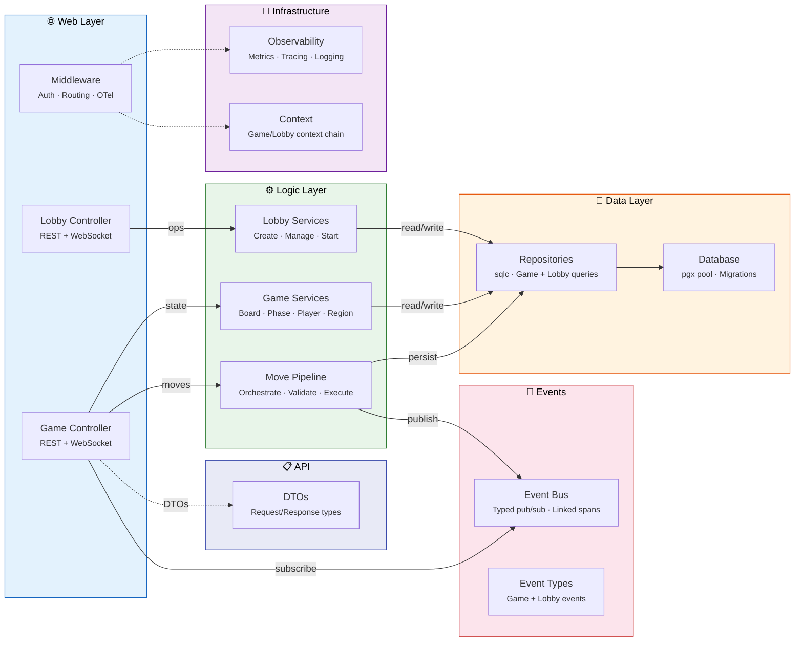

# Architecture Diagram

```mermaid
graph LR
    subgraph Web["🌐 Web Layer"]
        direction TB
        GameCtrl["Game Controller<br/><small>REST + WebSocket</small>"]
        LobbyCtrl["Lobby Controller<br/><small>REST + WebSocket</small>"]
        Middleware["Middleware<br/><small>Auth · Routing · OTel</small>"]
    end

    subgraph API["📋 API"]
        DTOs["DTOs<br/><small>Request/Response types</small>"]
    end

    subgraph Logic["⚙️ Logic Layer"]
        direction TB
        MovePipeline["Move Pipeline<br/><small>Orchestrate · Validate · Execute</small>"]
        GameSvc["Game Services<br/><small>Board · Phase · Player · Region</small>"]
        LobbySvc["Lobby Services<br/><small>Create · Manage · Start</small>"]
    end

    subgraph Events["📡 Events"]
        direction TB
        EventBus["Event Bus<br/><small>Typed pub/sub · Linked spans</small>"]
        EventTypes["Event Types<br/><small>Game + Lobby events</small>"]
    end

    subgraph Data["💾 Data Layer"]
        direction TB
        Repos["Repositories<br/><small>sqlc · Game + Lobby queries</small>"]
        DB["Database<br/><small>pgx pool · Migrations</small>"]
    end

    subgraph Infra["🔧 Infrastructure"]
        direction TB
        Observability["Observability<br/><small>Metrics · Tracing · Logging</small>"]
        Context["Context<br/><small>Game/Lobby context chain</small>"]
    end

    %% Web → Logic
    GameCtrl -->|moves| MovePipeline
    GameCtrl -->|state| GameSvc
    LobbyCtrl -->|ops| LobbySvc

    %% Web → API
    GameCtrl -.->|DTOs| DTOs

    %% Web → Events
    GameCtrl -->|subscribe| EventBus

    %% Logic → Events
    MovePipeline -->|publish| EventBus

    %% Logic → Data
    MovePipeline -->|persist| Repos
    GameSvc -->|read/write| Repos
    LobbySvc -->|read/write| Repos

    %% Data internal
    Repos --> DB

    %% Infrastructure
    Middleware -.-> Observability
    Middleware -.-> Context

    %% Styling
    style Web fill:#E3F2FD,stroke:#1565C0,color:#000
    style API fill:#E8EAF6,stroke:#3949AB,color:#000
    style Logic fill:#E8F5E9,stroke:#2E7D32,color:#000
    style Events fill:#FCE4EC,stroke:#C62828,color:#000
    style Data fill:#FFF3E0,stroke:#E65100,color:#000
    style Infra fill:#F3E5F5,stroke:#6A1B9A,color:#000
```
