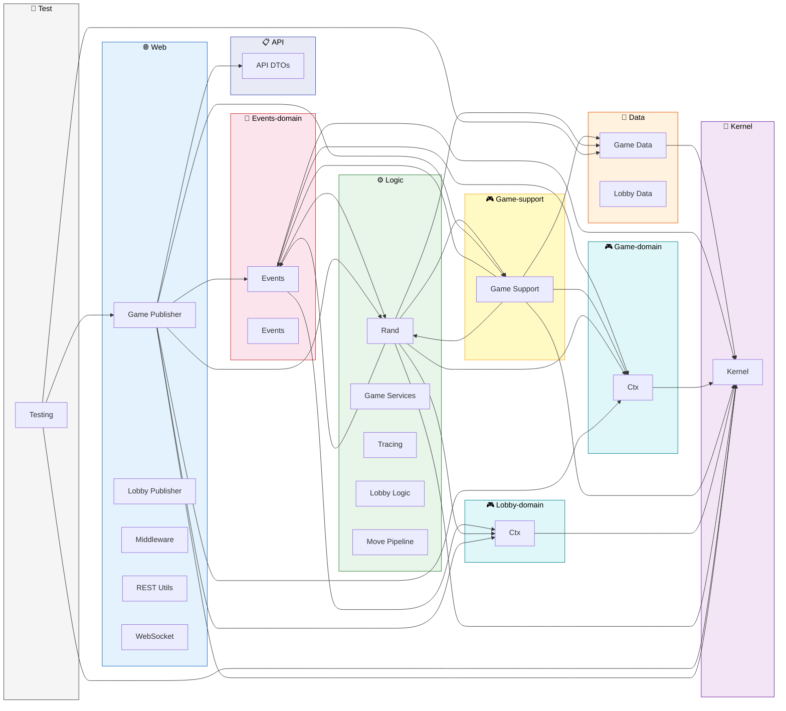

# Architecture Diagram

<!-- GEN:MERMAID_COMPONENT_ARCH_START -->
<!-- DO NOT EDIT — auto-generated by make docs -->

```mermaid
graph LR
    subgraph API["📋 API"]
        direction TB
        apidtos["API DTOs"]
    end

    subgraph Kernel["🔧 Kernel"]
        direction TB
        kernel["Kernel"]
    end

    subgraph Data["💾 Data"]
        direction TB
        gamedata["Game Data"]
        lobbydata["Lobby Data"]
    end

    subgraph Eventsdomain["📡 Events-domain"]
        direction TB
        gameevents["Events"]
        lobbyevents["Events"]
    end

    subgraph Gamedomain["🎮 Game-domain"]
        direction TB
        gamectx["Ctx"]
    end

    subgraph Gamesupport["🎮 Game-support"]
        direction TB
        gamesupport["Game Support"]
    end

    subgraph Lobbydomain["🎮 Lobby-domain"]
        direction TB
        lobbyctx["Ctx"]
    end

    subgraph Logic["⚙️ Logic"]
        direction TB
        gamerand["Rand"]
        gameservices["Game Services"]
        gametracing["Tracing"]
        lobbylogic["Lobby Logic"]
        movepipeline["Move Pipeline"]
    end

    subgraph Web["🌐 Web"]
        direction TB
        gamepublisher["Game Publisher"]
        lobbypublisher["Lobby Publisher"]
        middleware["Middleware"]
        restutils["REST Utils"]
        websocket["WebSocket"]
    end

    subgraph Test["🧪 Test"]
        direction TB
        testing["Testing"]
    end

    %% Cross-layer dependencies
    gamedata --> kernel
    gameevents --> gamectx
    gameevents --> kernel
    gameevents --> lobbyctx
    gameevents --> gamerand
    gamectx --> kernel
    gamesupport --> gamedata
    gamesupport --> gameevents
    gamesupport --> gamectx
    gamesupport --> kernel
    gamesupport --> gamerand
    lobbyctx --> kernel
    gamerand --> gamedata
    gamerand --> gameevents
    gamerand --> gamectx
    gamerand --> gamesupport
    gamerand --> kernel
    gamerand --> lobbyctx
    testing --> gamedata
    testing --> kernel
    testing --> gamepublisher
    gamepublisher --> apidtos
    gamepublisher --> gameevents
    gamepublisher --> gamectx
    gamepublisher --> gamesupport
    gamepublisher --> kernel
    gamepublisher --> lobbyctx
    gamepublisher --> gamerand

    %% Styling
    style API fill:#E8EAF6,stroke:#3949AB,color:#000
    style Data fill:#FFF3E0,stroke:#E65100,color:#000
    style Eventsdomain fill:#FCE4EC,stroke:#C62828,color:#000
    style Gamedomain fill:#E0F7FA,stroke:#00838F,color:#000
    style Gamesupport fill:#FFF9C4,stroke:#F9A825,color:#000
    style Kernel fill:#F3E5F5,stroke:#6A1B9A,color:#000
    style Lobbydomain fill:#E0F7FA,stroke:#00838F,color:#000
    style Logic fill:#E8F5E9,stroke:#2E7D32,color:#000
    style Test fill:#F5F5F5,stroke:#424242,color:#000
    style Web fill:#E3F2FD,stroke:#1565C0,color:#000
```
<!-- GEN:MERMAID_COMPONENT_ARCH_END -->
