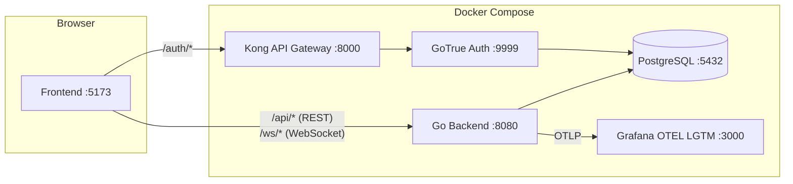
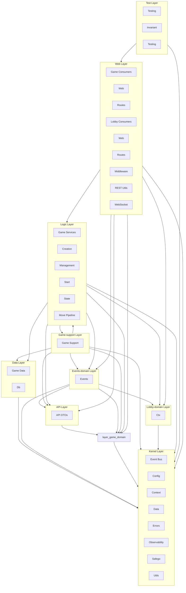
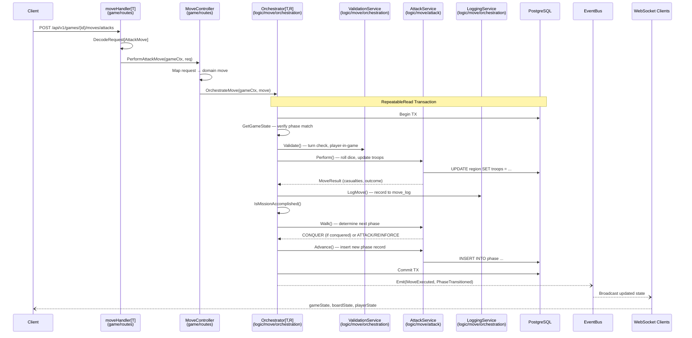
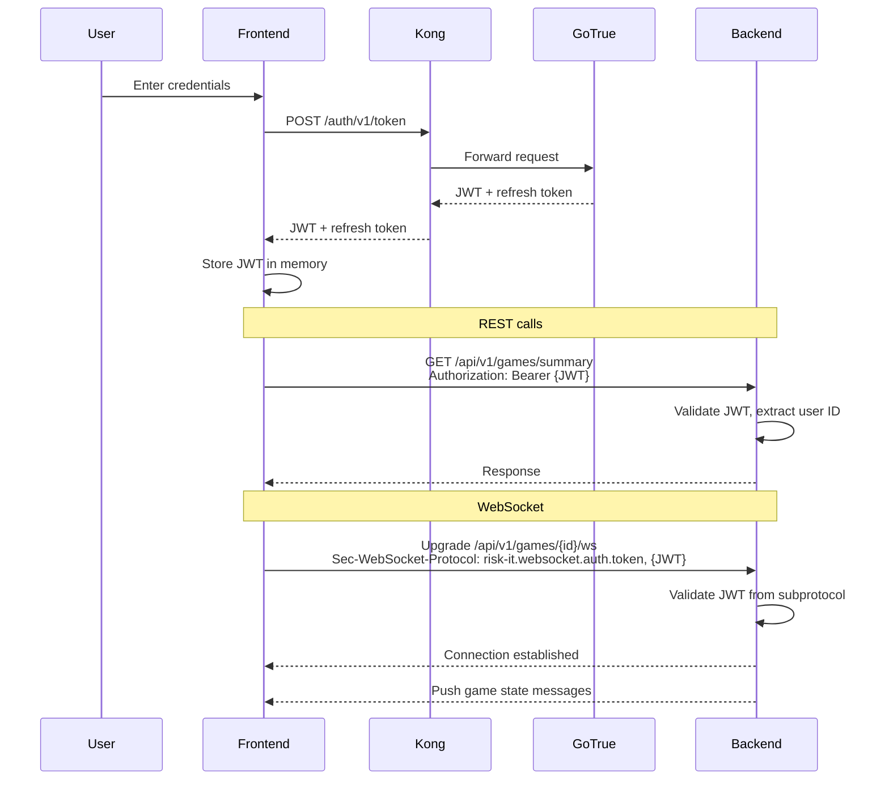
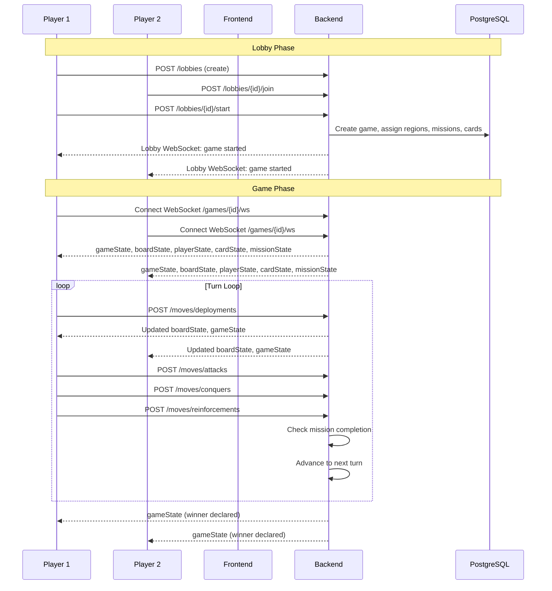
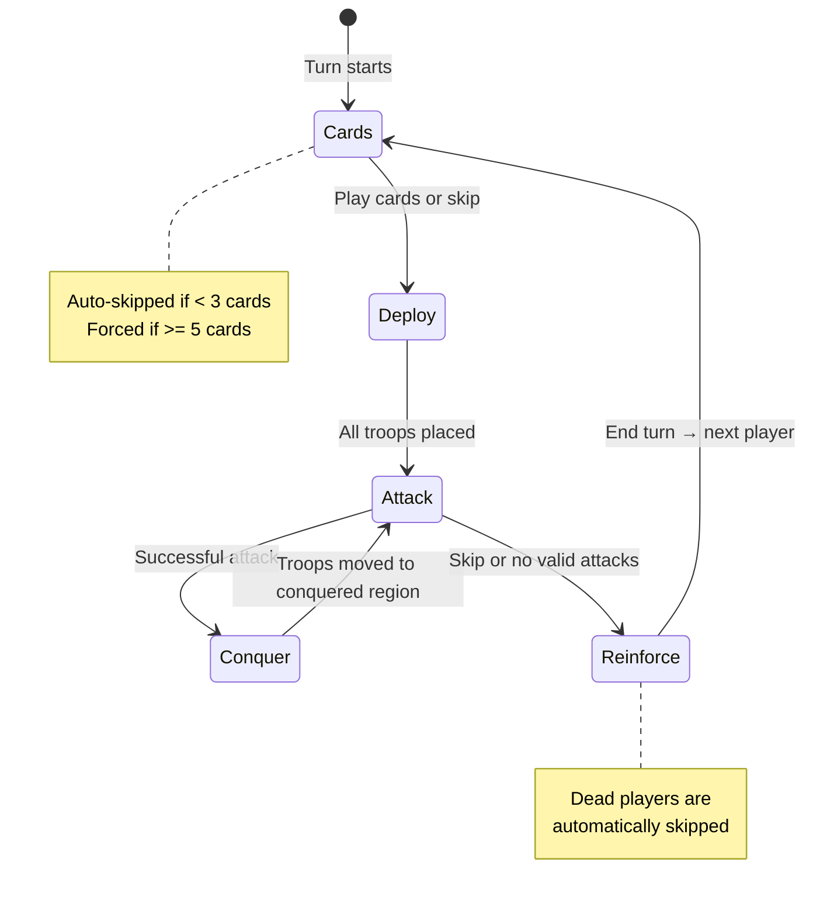

# Architecture

This document describes the architecture of the go-risk-it system — a multiplayer online Risk board game.

## System Overview



| Service | Port | Purpose |
|---------|------|---------|
| Frontend (Vite dev server) | 5173 | Svelte 5 SPA |
| Go Backend | 8080 | Game engine, REST API, WebSocket |
| Kong | 8000 | API gateway for auth routes |
| GoTrue | 9999 | Supabase auth (JWT issuance) |
| PostgreSQL | 5432 | Persistent storage (game + lobby schemas) |
| Grafana OTEL LGTM | 3000 | Observability stack (traces, metrics, logs) |

## Go Package Architecture

The backend follows a strict **10-layer architecture** enforced through Go packages and Uber Fx dependency injection. Import rules are validated by `arch_test.go` — each layer only depends on permitted layers below it. See the [Layer Taxonomy](doc-go-spec.md) for the full set and import constraints.

<!-- GEN:MERMAID_PACKAGE_ARCH_START -->
<!-- DO NOT EDIT — auto-generated by make docs -->

<!-- GEN:MERMAID_PACKAGE_ARCH_END -->

### Uber Fx Dependency Injection

<!-- Hand-maintained: Fx module tree auto-generation rejected — fx.Options() parsing
     too fragile for Go import aliasing (gamelogic, riskslog, gamemetrics, etc.) and
     inline fx.Provide() calls. Update manually when wiring changes. Source of truth:
     cmd/risk-it-server/app/app.go + internal/{game,lobby,web}/*.go -->
The application uses [Uber Fx](https://github.com/uber-go/fx) for compile-time-safe dependency injection. The module hierarchy mirrors the package layers:

```
app.Module
├── config.Module           # Koanf config loading
├── slog.Module             # Structured JSON logging (log/slog)
├── logger.Module           # Logger setup
├── metrics.Module          # OTel metrics infrastructure
├── gamelogic.Module        # Game business logic
│   ├── advancement.Module  # Phase advancement
│   ├── board.Module        # Board topology
│   ├── card.Module         # Card management
│   ├── creation.Module     # Game creation
│   ├── bus.Module          # Event bus
│   ├── gamemetrics.Module  # Game-specific metrics + timing
│   ├── mission.Module      # Mission checking
│   ├── move.Module         # Move pipeline
│   │   ├── deploy, attack, conquer, reinforce, cards Services
│   │   ├── dice.Module     # Dice rolling
│   │   └── orchestration.Module  # Move orchestrator + validation + logging
│   ├── phase.Module        # Phase transitions
│   ├── player.Module       # Player management
│   ├── region.Module       # Region ownership
│   └── state.Module        # Game state queries
├── gamedata.Module         # Game DB pool, migrations, SQLC queries
├── lobbylogic.Module       # Lobby business logic
│   ├── creation.Module     # Lobby creation
│   ├── management.Module   # Lobby join/leave
│   ├── state.Module        # Lobby state queries
│   └── start.Module        # Lobby → game start
├── lobbydata.Module        # Lobby DB pool, migrations, SQLC queries
├── web.Module              # HTTP/WS infrastructure
│   ├── middleware.Module   # JWT auth middleware
│   ├── mux.Module          # Route registration
│   ├── nbio.Module         # nbio HTTP engine
│   ├── otelsetup.Module    # OpenTelemetry setup
│   ├── rest.Module         # Health check + route helpers
│   └── ws.Module           # WebSocket upgrader
├── game.Module             # Game web layer (routes + WS + publisher)
│   ├── gameconfig.Module   # Game config (map.json)
│   ├── headlines.Module    # Headline event detection
│   ├── snapshot.Module     # Game state snapshots
│   ├── routes.Module       # Game REST + WS route handlers
│   ├── ws.Module           # Game WS connection manager
│   └── consumers.Module    # Game event → WS broadcast consumers
├── lobby.Module            # Lobby web layer (routes + WS + consumers)
│   ├── routes.Module       # Lobby REST + WS route handlers
│   ├── ws.Module           # Lobby WS connection manager
│   └── consumers.Module    # Lobby event → WS broadcast consumers
└── rand.Module             # Random number generation
```

Each package exposes a `var Module = fx.Options(...)` that declares its providers. Fx wires everything together at startup — if a dependency is missing or circular, the app fails to start with a clear error message.

## Move Execution Flow

This sequence shows how a move request (e.g., an attack) flows through the code layers:



### Service Interface Pattern

Each move type (deploy, attack, conquer, reinforce, cards) implements a generic `Service[T, R]` interface composed of three roles:

| Role | Method | Responsibility |
|------|--------|----------------|
| **Performer** | `Perform(ctx, querier, move T) → R` | Execute the move logic |
| **PhaseWalker** | `Walk(ctx, querier, voluntary bool) → PhaseType` | Determine next phase |
| **Advancer** | `Advance(ctx, querier, targetPhase, result R)` | Transition to new phase |

The orchestrator calls these three methods in sequence inside a single database transaction with `RepeatableRead` isolation, ensuring atomic state transitions. Validation and move logging are handled by separate `ValidationService` and `LoggingService` interfaces within the orchestration package.

## Board Topology

The game board consists of **42 regions** organized into **6 continents**. Controlling all regions in a continent grants bonus troops each turn.

| Continent | Regions | Bonus Troops |
|-----------|---------|--------------|
| Asia | 12 | 7 |
| North America | 9 | 5 |
| Europe | 7 | 5 |
| Africa | 6 | 3 |
| South America | 4 | 2 |
| Oceania | 4 | 2 |

Region adjacency (including cross-continent links) is defined in [`map.json`](../map.json) and loaded at game creation. The board topology is a static graph — adjacency is used for attack validation, conquer movement, and BFS-based reinforcement pathfinding.

## Authentication Flow



## Game Lifecycle



## Game Phase State Machine



### Phase Details

| Phase | Action | Endpoint |
|-------|--------|----------|
| **Cards** | Trade card combinations for bonus troops | `POST /moves/cards` |
| **Deploy** | Place troops on owned regions | `POST /moves/deployments` |
| **Attack** | Attack adjacent enemy regions | `POST /moves/attacks` |
| **Conquer** | Move troops into newly conquered region | `POST /moves/conquers` |
| **Reinforce** | Move troops between connected owned regions | `POST /moves/reinforcements` |

## REST API Reference

All endpoints except `/status` require a valid JWT in the `Authorization: Bearer {token}` header.

### Health

| Method | Path | Description |
|--------|------|-------------|
| GET | `/status` | Health check (no auth) |

### Lobby

| Method | Path | Description |
|--------|------|-------------|
| POST | `/api/v1/lobbies` | Create a new lobby |
| GET | `/api/v1/lobbies/summary` | List lobbies for current user |
| POST | `/api/v1/lobbies/{id}/join` | Join a lobby |
| POST | `/api/v1/lobbies/{id}/start` | Start game from lobby |

### Game

| Method | Path | Description |
|--------|------|-------------|
| POST | `/api/v1/games` | Create a new game |
| GET | `/api/v1/games/summary` | List games for current user |
| POST | `/api/v1/games/{id}/advancements` | Advance phase (dead player skip) |

### Moves

| Method | Path | Phase | Description |
|--------|------|-------|-------------|
| POST | `/api/v1/games/{id}/moves/cards` | Cards | Trade card combinations |
| POST | `/api/v1/games/{id}/moves/deployments` | Deploy | Place troops on a region |
| POST | `/api/v1/games/{id}/moves/attacks` | Attack | Attack an adjacent region |
| POST | `/api/v1/games/{id}/moves/conquers` | Conquer | Move troops after conquest |
| POST | `/api/v1/games/{id}/moves/reinforcements` | Reinforce | Redistribute troops |

### Test-Only (Component Tests)

| Method | Path | Description |
|--------|------|-------------|
| POST | `/api/v1/reset` | Reset all database state |
| POST | `/api/v1/setup-near-win` | Setup game near victory for E2E testing |

## WebSocket Protocol

### Connection

- **Game**: `ws://host/api/v1/games/{id}/ws`
- **Lobby**: `ws://host/api/v1/lobbies/{id}/ws`
- **Auth**: JWT passed via WebSocket subprotocol header: `Sec-WebSocket-Protocol: risk-it.websocket.auth.token, {JWT}`

### Message Envelope

All messages follow this format:

```json
{
  "type": "<messageType>",
  "data": { ... }
}
```

### Message Types

| Type | Direction | Description |
|------|-----------|-------------|
| `gameState` | Server → Client | Current turn, phase type, game ID |
| `boardState` | Server → Client | All regions with owner and troop count |
| `playerState` | Server → Client | All players with status, card count, connection |
| `cardState` | Server → Client | Current player's cards (private per player) |
| `missionState` | Server → Client | Current player's secret mission (private) |
| `moveHistory` | Server → Client | Log of all moves in the game |
| `lobbyState` | Server → Client | Lobby participants and readiness |

## Database

Two PostgreSQL schemas, auto-migrated on startup via [golang-migrate](https://github.com/golang-migrate/migrate):

### `lobby` Schema

| Table | Purpose |
|-------|---------|
| `lobby` | Lobby instances (owner, linked game) |
| `participant` | Players in a lobby |

### `game` Schema

| Table | Purpose |
|-------|---------|
| `game` | Game instances (current phase, winner) |
| `player` | Players in a game (turn order, status) |
| `region` | Board regions (owner, troop count) |
| `card` | Risk cards (type, owner) |
| `phase` | Phase records (type, turn number) |
| `deploy_phase` | Deploy-specific state (remaining troops) |
| `conquer_phase` | Conquer-specific state (source/target regions, min troops) |
| `mission` | Player missions |
| `two_continents_mission` | Mission: conquer 2 specific continents |
| `two_continents_plus_one_mission` | Mission: conquer 2 continents + 1 of choice |
| `eliminate_player_mission` | Mission: eliminate a specific player |
| `move_log` | Move history (JSONB data + results) |

### Enums

- **phase_type**: `CARDS`, `DEPLOY`, `ATTACK`, `CONQUER`, `REINFORCE`
- **card_type**: `CAVALRY`, `INFANTRY`, `ARTILLERY`, `JOLLY`
- **mission_type**: `EIGHTEEN_TERRITORIES_TWO_TROOPS`, `TWENTY_FOUR_TERRITORIES`, `TWO_CONTINENTS`, `TWO_CONTINENTS_PLUS_ONE`, `ELIMINATE_PLAYER`

## Observability

The backend emits traces, metrics, and logs via [OpenTelemetry](https://opentelemetry.io/) to [Grafana OTEL LGTM](https://github.com/grafana/docker-otel-lgtm):

- **Protocol**: OTLP over HTTP (`http://lgtm:4318`)
- **Service name**: `risk-it`
- **Grafana UI**: http://localhost:3000
- **EventBus**: Post-commit events use OTel linked spans to connect transaction traces with async consumer traces

All REST handlers and database operations are instrumented with spans for request tracing.

## Additional Documentation

- **[Component Architecture](architecture-components.md)** — Mermaid flowchart showing subsystem groupings and layer relationships
- **[Auto-Generated Diagram](architecture-diagram.svg)** — D2 diagram generated from the import graph, CI-checked for freshness
- **[Testing Philosophy](testing-philosophy.md)** — Invariant-based testing strategy with 12 game-state properties
- **[doc.go Specification](doc-go-spec.md)** — Living documentation format and layer taxonomy
