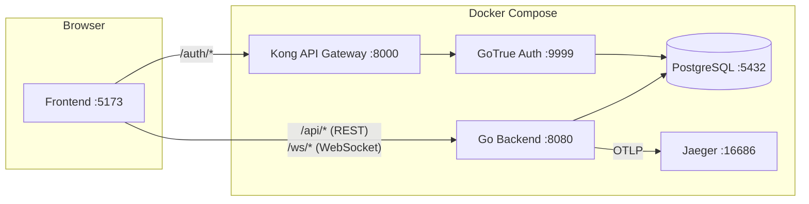
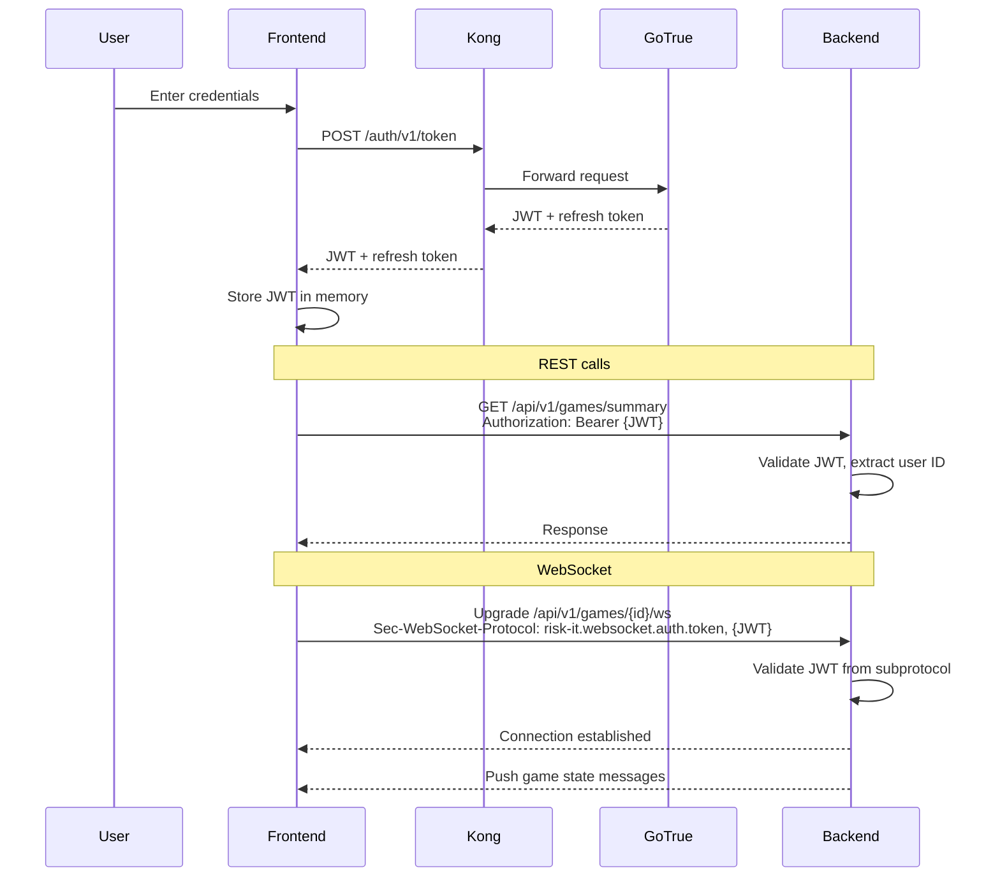
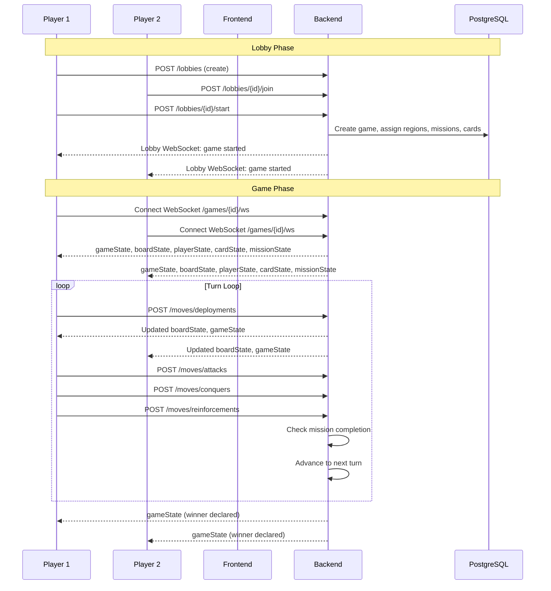
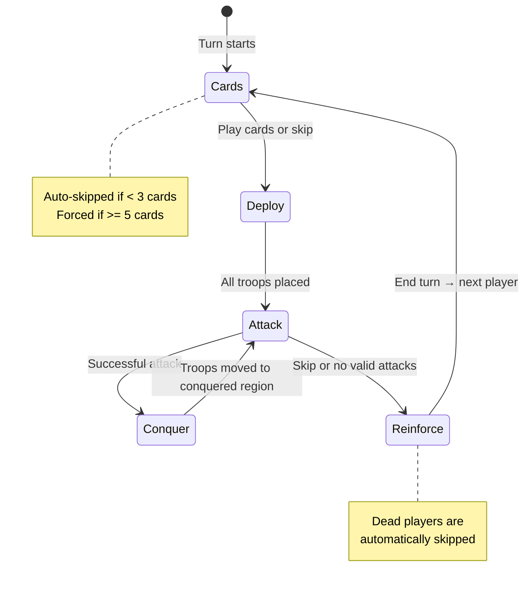

# Architecture

This document describes the architecture of the go-risk-it system — a multiplayer online Risk board game.

## System Overview



| Service | Port | Purpose |
|---------|------|---------|
| Frontend (Vite dev server) | 5173 | Svelte 5 SPA |
| Go Backend | 8080 | Game engine, REST API, WebSocket |
| Kong | 8000 | API gateway for auth routes |
| GoTrue | 9999 | Supabase auth (JWT issuance) |
| PostgreSQL | 5432 | Persistent storage (game + lobby schemas) |
| Jaeger | 16686 | Distributed tracing UI |

## Authentication Flow



## Game Lifecycle



## Game Phase State Machine



### Phase Details

| Phase | Action | Endpoint |
|-------|--------|----------|
| **Cards** | Trade card combinations for bonus troops | `POST /moves/cards` |
| **Deploy** | Place troops on owned regions | `POST /moves/deployments` |
| **Attack** | Attack adjacent enemy regions | `POST /moves/attacks` |
| **Conquer** | Move troops into newly conquered region | `POST /moves/conquers` |
| **Reinforce** | Move troops between connected owned regions | `POST /moves/reinforcements` |

## REST API Reference

All endpoints except `/healthz` require a valid JWT in the `Authorization: Bearer {token}` header.

### Health

| Method | Path | Description |
|--------|------|-------------|
| GET | `/healthz` | Health check (no auth) |

### Lobby

| Method | Path | Description |
|--------|------|-------------|
| POST | `/api/v1/lobbies` | Create a new lobby |
| GET | `/api/v1/lobbies/summary` | List lobbies for current user |
| POST | `/api/v1/lobbies/{id}/join` | Join a lobby |
| POST | `/api/v1/lobbies/{id}/start` | Start game from lobby |

### Game

| Method | Path | Description |
|--------|------|-------------|
| POST | `/api/v1/games` | Create a new game |
| GET | `/api/v1/games/summary` | List games for current user |
| POST | `/api/v1/games/{id}/advancements` | Advance phase (dead player skip) |

### Moves

| Method | Path | Phase | Description |
|--------|------|-------|-------------|
| POST | `/api/v1/games/{id}/moves/cards` | Cards | Trade card combinations |
| POST | `/api/v1/games/{id}/moves/deployments` | Deploy | Place troops on a region |
| POST | `/api/v1/games/{id}/moves/attacks` | Attack | Attack an adjacent region |
| POST | `/api/v1/games/{id}/moves/conquers` | Conquer | Move troops after conquest |
| POST | `/api/v1/games/{id}/moves/reinforcements` | Reinforce | Redistribute troops |

### Test-Only (Component Tests)

| Method | Path | Description |
|--------|------|-------------|
| POST | `/api/v1/reset` | Reset all database state |
| POST | `/api/v1/setup-near-win` | Setup game near victory for E2E testing |

## WebSocket Protocol

### Connection

- **Game**: `ws://host/api/v1/games/{id}/ws`
- **Lobby**: `ws://host/api/v1/lobbies/{id}/ws`
- **Auth**: JWT passed via WebSocket subprotocol header: `Sec-WebSocket-Protocol: risk-it.websocket.auth.token, {JWT}`

### Message Envelope

All messages follow this format:

```json
{
  "type": "<messageType>",
  "data": { ... }
}
```

### Message Types

| Type | Direction | Description |
|------|-----------|-------------|
| `gameState` | Server → Client | Current turn, phase type, game ID |
| `boardState` | Server → Client | All regions with owner and troop count |
| `playerState` | Server → Client | All players with status, card count, connection |
| `cardState` | Server → Client | Current player's cards (private per player) |
| `missionState` | Server → Client | Current player's secret mission (private) |
| `moveHistory` | Server → Client | Log of all moves in the game |
| `lobbyState` | Server → Client | Lobby participants and readiness |

## Database

Two PostgreSQL schemas, auto-migrated on startup via [golang-migrate](https://github.com/golang-migrate/migrate):

### `lobby` Schema

| Table | Purpose |
|-------|---------|
| `lobby` | Lobby instances (owner, linked game) |
| `participant` | Players in a lobby |

### `game` Schema

| Table | Purpose |
|-------|---------|
| `game` | Game instances (current phase, winner) |
| `player` | Players in a game (turn order, status) |
| `region` | Board regions (owner, troop count) |
| `card` | Risk cards (type, owner) |
| `phase` | Phase records (type, turn number) |
| `deploy_phase` | Deploy-specific state (remaining troops) |
| `conquer_phase` | Conquer-specific state (source/target regions, min troops) |
| `mission` | Player missions |
| `two_continents_mission` | Mission: conquer 2 specific continents |
| `two_continents_plus_one_mission` | Mission: conquer 2 continents + 1 of choice |
| `eliminate_player_mission` | Mission: eliminate a specific player |
| `move_log` | Move history (JSONB data + results) |

### Enums

- **phase_type**: `CARDS`, `DEPLOY`, `ATTACK`, `CONQUER`, `REINFORCE`
- **card_type**: `CAVALRY`, `INFANTRY`, `ARTILLERY`, `JOLLY`
- **mission_type**: `EIGHTEEN_TERRITORIES_TWO_TROOPS`, `TWENTY_FOUR_TERRITORIES`, `TWO_CONTINENTS`, `TWO_CONTINENTS_PLUS_ONE`, `ELIMINATE_PLAYER`

## Observability

The backend emits traces via [OpenTelemetry](https://opentelemetry.io/) to Jaeger:

- **Protocol**: OTLP over HTTP (`http://jaeger:4318`)
- **Service name**: `risk-it`
- **Jaeger UI**: http://localhost:16686

All REST handlers and database operations are instrumented with spans for request tracing.
