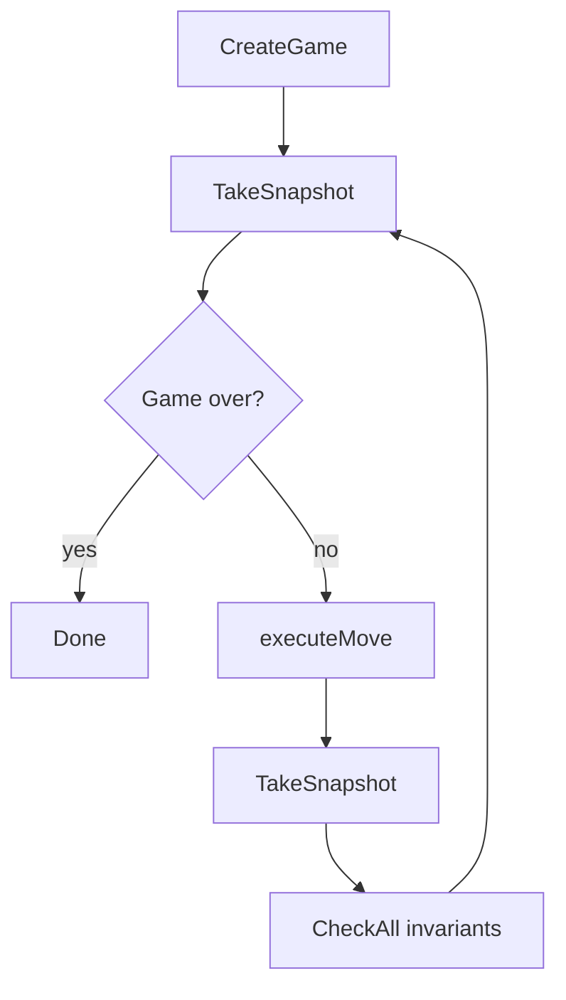

# Testing Philosophy

go-risk-it uses an invariant-based testing strategy: instead of asserting specific game outcomes, we define 12 properties that must hold after every single move in every possible game. A simulation harness plays thousands of randomized games against a real Postgres database, checking all invariants at each step. If any invariant breaks, the property-based testing framework (rapid) shrinks the failing case to a minimal reproducer.

## Architecture

The invariant testing system has four components:

| Component | Role |
|-----------|------|
| **Harness** | Boots a real Postgres via testcontainers-go, runs golang-migrate migrations, wires the full application with fx. Deterministic config: `DiceConfig{RollStrategy: "attacker_always_wins"}`, `RegionassignmentConfig{AssignmentStrategy: "sequential"}`. |
| **Snapshot** | Captures full board state after every move. `GameSnapshot` contains GameID, Phase (`sqlc.GamePhaseType`), Turn (`int64`), Winner (`string`), Regions, Players, and TotalCardCount. |
| **Generator** | Produces valid random moves using `math/rand/v2` with a PCG source. Methods: `CardsMove`, `DeployMove`, `AttackMove`, `ConquerMove`. Each method inspects the current snapshot to generate a legal move for the active phase. |
| **Simulation loop** | Drives a game from creation to completion (or MaxMoves), taking a snapshot and running all 12 invariants after every move. |

### Simulation Loop



## The 12 Invariants

`AllInvariants` is a `[]Invariant` slice. `CheckAll` iterates every invariant against the current snapshot and fails the test on the first violation.

| # | Name | Description |
|---|------|-------------|
| 1 | EveryRegionHasMinOneTroop | Every region has at least 1 troop. CONQUER phase allows a transient 0 during the move. |
| 2 | EveryRegionHasExactlyOneOwner | No unowned regions; every region has a non-empty UserID. |
| 3 | RegionCountEquals42 | The board always has exactly 42 regions. |
| 4 | PhaseIsValid | Phase is one of: CARDS, DEPLOY, ATTACK, CONQUER, REINFORCE. |
| 5 | TurnNeverDecreases | Turn number is monotonically non-decreasing across snapshots. |
| 6 | TroopDeltaMatchesPhase | Troop changes match the phase: DEPLOY/CARDS add troops, ATTACK removes troops, CONQUER/REINFORCE are neutral. |
| 7 | AllRegionsAccountedForInPlayerCounts | Each player's RegionCount matches the actual count of regions they own on the board. |
| 8 | EliminatedPlayersOwnNoRegions | Players with RegionCount=0 have no regions on the board. |
| 9 | TroopConservation | Total troops across all regions is always >= 42 (initial minimum: one per region). |
| 10 | CardDeckConservation | Total cards in the system always equals 44 (42 region cards + 2 jokers). |
| 11 | PhaseTransitionLegality | Transitions follow the legal graph: CARDS->DEPLOY, DEPLOY->ATTACK, ATTACK->{CONQUER,REINFORCE}, CONQUER->{ATTACK,REINFORCE}, REINFORCE->{CARDS,DEPLOY}. |
| 12 | TerritoryIntegrity | 42 regions exist, each has an owner, none have negative troops. |

Constants: `initialMinTroops = 42`, `expectedCardCount = 44`.

## Property-Based Testing with Rapid

The invariant suite uses [pgregory.net/rapid](https://pkg.go.dev/pgregory.net/rapid) for property-based testing with automatic shrinking.

- `TestPropertyInvariantsHold` runs N iterations (100 locally, 200 in CI).
- Each iteration draws a random seed from rapid, giving full reproducibility and minimal-case shrinking on failure.
- `RapidSimulationConfig`: `NumPlayers=3`, `MaxMoves=200`.
- Deterministic dice (`attacker_always_wins`) and sequential region assignment eliminate randomness outside the move generator, so failures always reproduce.
- Games that do not complete within MaxMoves are acceptable -- invariants are checked on every move, not just at game end.

### Test Functions

| Function | Purpose |
|----------|---------|
| `TestMain` | Testcontainer setup and migration |
| `TestCanCreateGame` | Smoke test: game creation succeeds |
| `TestGameToCompletion` | Single game with seed 42, up to 5000 moves |
| `TestPropertyInvariantsHold` | Property-based: N random games, all invariants on every move |

## CI Pipeline

Defined in `.github/workflows/invariant.yml`.

| Setting | Value |
|---------|-------|
| Triggers | Push to main, PRs to main, merge queue |
| Runner | `ubuntu-latest` |
| Env | `INVARIANT_GAME_COUNT=200` |
| Build tag | `-tags invariant` (isolates from regular `go test ./...`) |
| Timeout | 5 minutes (200 game simulations + testcontainer startup) |

Command:

```bash
go test -tags invariant -v -timeout 300s \
  ./internal/testing/invariant/ \
  -args -rapid.checks="${INVARIANT_GAME_COUNT}"
```

## Running Locally

Docker must be running -- testcontainers starts Postgres automatically.

**Quick smoke test** (single game, seed 42):

```bash
go test -tags invariant -v -timeout 120s \
  -run TestGameToCompletion \
  ./internal/testing/invariant/
```

**Property testing** (100 random games):

```bash
go test -tags invariant -v -timeout 300s \
  -run TestPropertyInvariantsHold \
  ./internal/testing/invariant/
```

**Extended fuzzing** (10,000 games):

```bash
go test -tags invariant -v -timeout 1800s \
  -run TestPropertyInvariantsHold \
  ./internal/testing/invariant/ \
  -args -rapid.checks=10000
```
